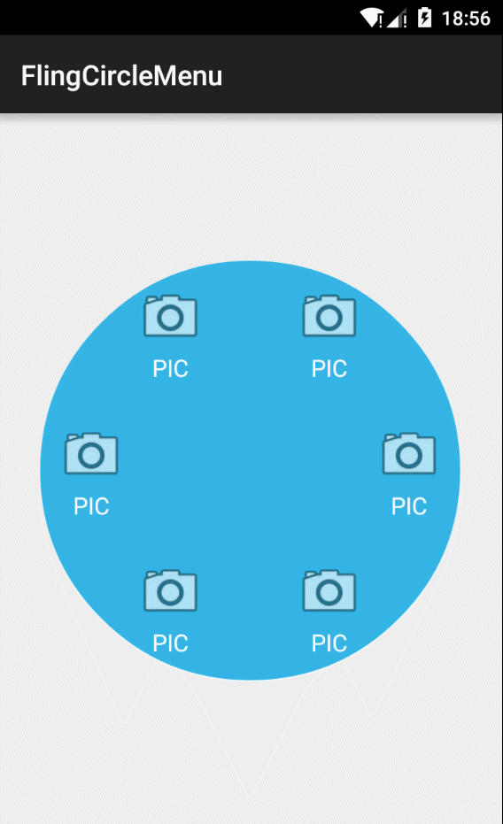

# FlingCircleMenu
A fling circle menu for Android

## screen shot

## usage

    protected void onCreate(Bundle savedInstanceState) {
            super.onCreate(savedInstanceState);
            setContentView(R.layout.activity_main);
    
            FlingCircleMenuLayout flingCircleMenuLayout = (FlingCircleMenuLayout) findViewById(R.id.circlelayout);
    
            View item1 = LayoutInflater.from(this).inflate(R.layout.menu_item_layout,flingCircleMenuLayout,false);
            View item2 = LayoutInflater.from(this).inflate(R.layout.menu_item_layout,flingCircleMenuLayout,false);
            View item3 = LayoutInflater.from(this).inflate(R.layout.menu_item_layout,flingCircleMenuLayout,false);
            View item4 = LayoutInflater.from(this).inflate(R.layout.menu_item_layout,flingCircleMenuLayout,false);
            View item5 = LayoutInflater.from(this).inflate(R.layout.menu_item_layout,flingCircleMenuLayout,false);
            View item6 = LayoutInflater.from(this).inflate(R.layout.menu_item_layout,flingCircleMenuLayout,false);
    
            List<View> childList = new ArrayList<>();
            childList.add(item1);
            childList.add(item2);
            childList.add(item3);
            childList.add(item4);
            childList.add(item5);
            childList.add(item6);
    
            for(View view :childList){
                view.setOnClickListener(this);
            }
    
            flingCircleMenuLayout.setChildViewsList(childList);
        }

## todo

* add xml attributes support   
* padding support

## licence 

just do whatever you want.
